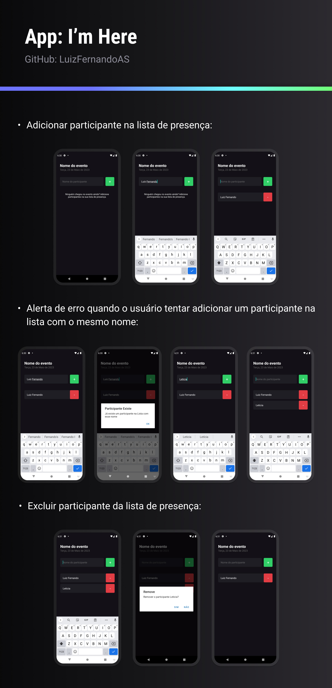

  

## 🚀 Tecnologias

Esse projeto foi desenvolvido com as seguintes tecnologias:

- React Native
- Expo Managed Workflow
- TypeScript

## 💻 Projeto

O I'm Here é um aplicativo mobile que tem funcionalidade de mostrar a lista de participantes de um evento, tendo opção de adicionar ou excluir o nome do participante da lista.

## 📝 Licença

Esse projeto está sob a licença MIT.

